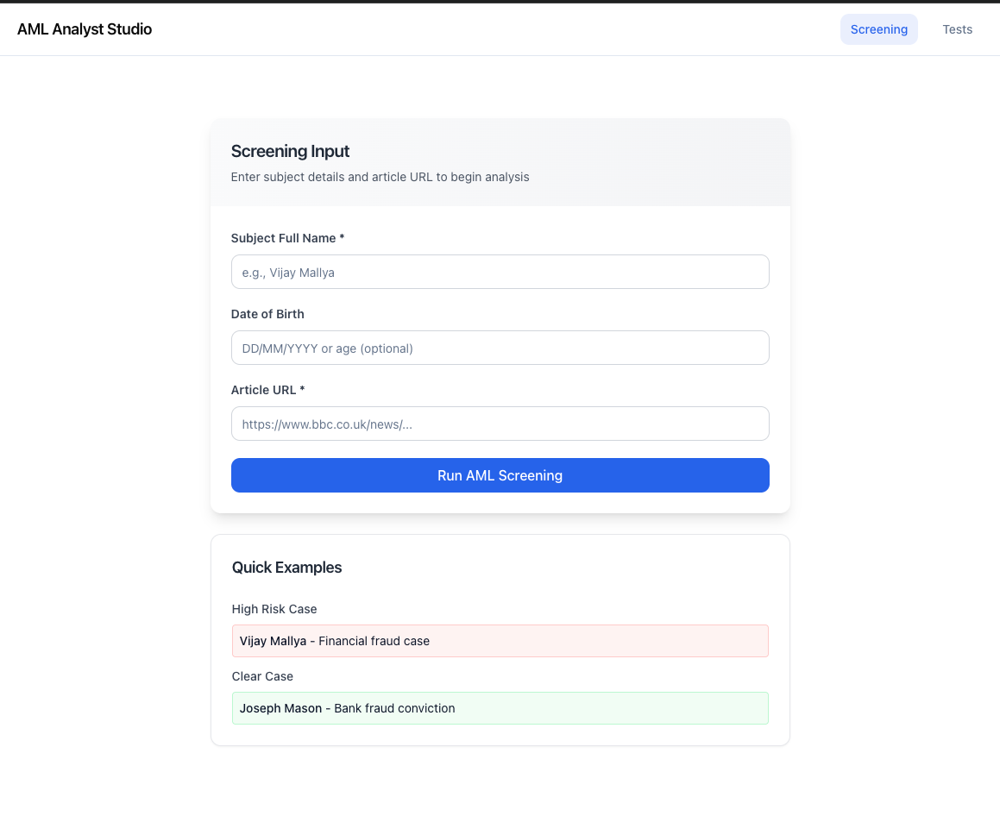
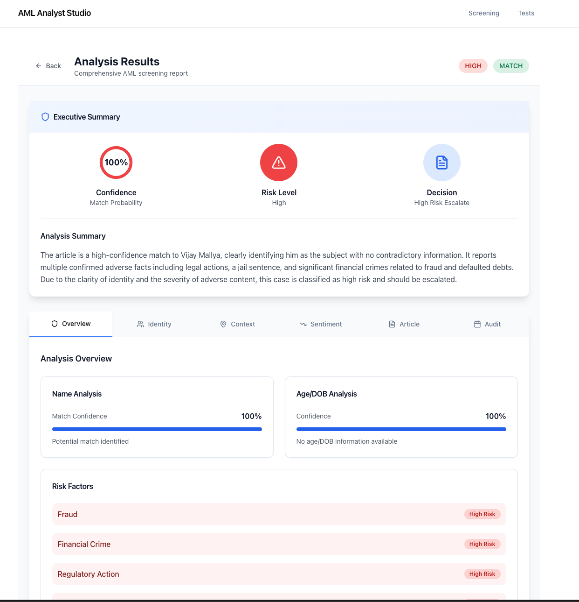
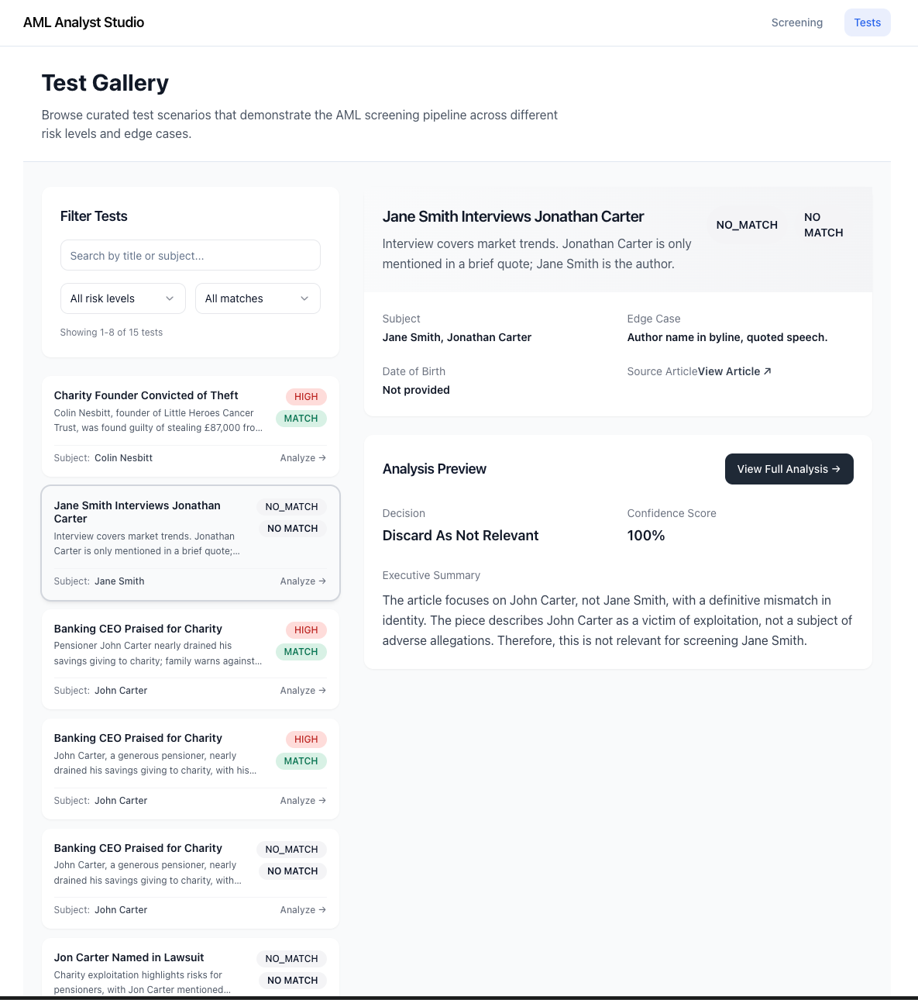
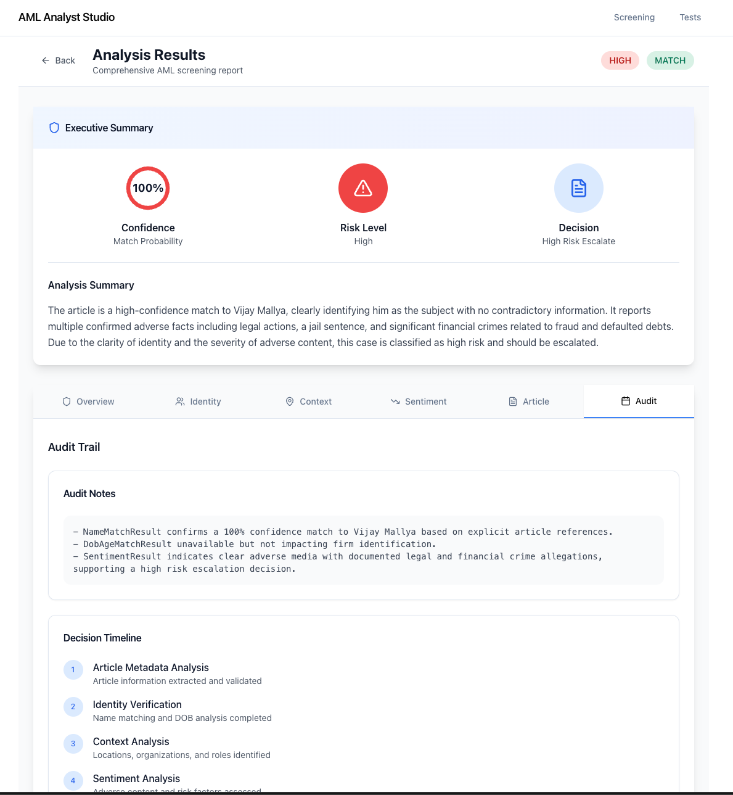
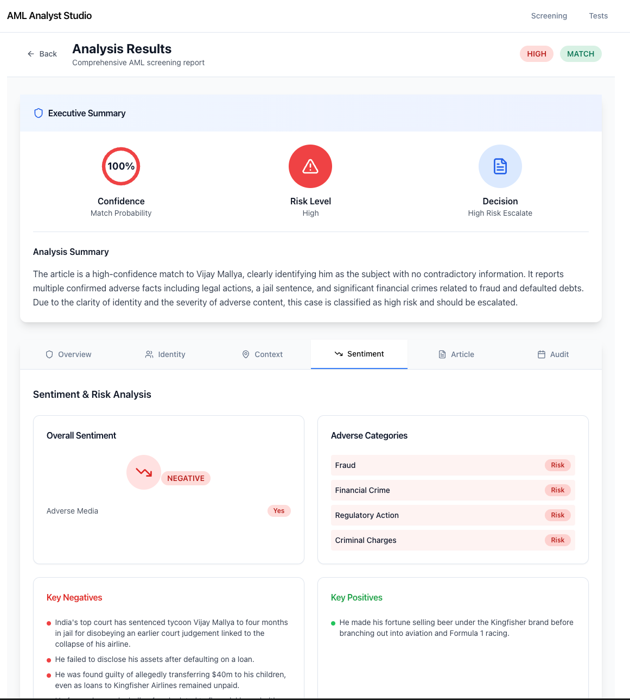

# Agentic Media Compliance

Agentic Media Compliance is a multi-agent AML adverse media screening engine that produces an auditable verdict for any news article. Ideal for KYC/AML, onboarding, and investigative workflows. Analysts submit a subject name, optional DOB, and an article URL to receive an explainable verdict, while a separate **Tests** view visualises curated regression cases stored under `backend/tests/results`.

## Contents

1. [Architecture Overview](#architecture-overview)
2. [Quick Start (Docker)](#quick-start-docker)
3. [Manual Setup](#manual-setup)
4. [Backend Reference](#backend-reference)
5. [Frontend Reference](#frontend-reference)
6. [Regression Tests](#regression-tests)
7. [Screenshots](#screenshots)
8. [Missing Data Enrichment Strategy (Part 2)](#missing-data-enrichment-strategy-part-2)
9. [Known Gaps / Future Work](#known-gaps--future-work)

---

## Architecture Overview

```
backend/   # FastAPI + OpenAI Agents pipeline, scraping helpers, logging
frontend/  # Next.js 14 App Router UI styled with shadcn + Tailwind
docker-compose.yml  # Spins up backend + frontend together
```

Agents:

- Article metadata, person, context, name match, DOB/age, sentiment, final decision.
- Final response includes audit notes + a “details” object so the UI can drill down by dimension.

## Quick Start (Docker)

```bash
git clone https://github.com/noah-sheldon/agentic-media-compliance.git
cd agentic-media-compliance

# Populate .env with OPENAI_API_KEY
OPENAI_API_KEY=sk-your-key

docker compose up --build
```

- Backend: http://localhost:8000 (FastAPI docs at `/docs`, health at `/api/health`)
- Frontend: http://localhost:3000 (Screening UI + Tests gallery)

Environment variables for docker compose:

- `.env` – `OPENAI_API_KEY`
- `frontend` service consumes `NEXT_PUBLIC_API_BASE` (set in `docker-compose.yml`)

## Backend Reference

- `pipeline/orchestrator.py` – Builds prompts, runs agents via `openai-agents` Runner, aggregates outputs
- `scraping/fetcher.py` – Simple HTML fetcher + cleaner (`scraping/cleaners.py`)
- `utils/test_results.py` – Loads all JSON snapshots for `/api/tests`
- `tests/test_screening_pipeline.py` – Executes entire pipeline for each entry in `tests/test_dataset.json` and saves results to `tests/results/<subject>.json`


## Frontend Reference

- `app/layout.tsx`, `app/globals.css` – Shared layout + theme tokens
- `app/page.tsx` – Screening form, state management, result rendering
- `app/tests/page.tsx` – Client-side filtering of regression cases
- `components/screening-result.tsx` – High-level verdict card + detail drill-down
- `components/test-result-card.tsx` – Displays edge-case context vs pipeline verdict side-by-side
- Shadcn primitives under `components/ui/*`

## Regression Tests

The provided dataset (`backend/tests/test_dataset.json`) includes curated edge cases. To refresh results:

```bash
cd backend
pytest tests/test_screening_pipeline.py
```

Each run stores a snapshot under `backend/tests/results/<subject>.json` consumed by `/tests` in the UI. Regenerate these whenever prompts/models change to keep the gallery aligned with reality.

## Screenshots

| Screen                                                    | Description                                                                 |
| --------------------------------------------------------- | --------------------------------------------------------------------------- |
|    | Main screening form where analysts enter subject name, DOB, and article URL |
|  | Comprehensive analysis results with risk assessment and decision summary    |
|                  | Test gallery with pagination, filters, and detailed test case views         |
|        | Detailed audit trail with agent reasoning and evidence tracking             |
|       | Sentiment analysis breakdown with confidence scores                         |
|  | Extracted article metadata and context information                          |

## Missing Data Enrichment Strategy (Part 2)

Real-world adverse-media screening often encounters incomplete articles: missing DOB, middle names, occupations, aliases, or only approximate ages (“a 45-year-old investor”). To avoid both false positives and false negatives, the system can be extended with a dedicated enrichment pipeline that augments the existing agents with controlled web search + structured extraction. (This enrichment stack is not yet implemented, but the design below aligns with the current architecture.)

### Why Enrichment Is Needed

- No explicit DOB, only age mentions.
- Middle names or aliases omitted.
- Article lacks occupation or location context.
- Multiple individuals share the same name (e.g., “John Smith”).

The enrichment service targets exactly these gaps, pulling identifiers from authoritative sources and providing auditable evidence.

### Architecture — Enrichment Orchestrator

```
Client Request
   ↓
Existing Screening Pipeline
   ↓
[ Attribute Detector → Should Enrich? ]
   ↓
[ Enrichment Orchestrator ]
   ↳ Query Generator Agent
   ↳ Search Agent (Perplexity → Serper → fallback)
   ↳ Scraper / Parser
   ↳ Entity Extraction Agent
   ↳ Cross-Verification Engine
   ↳ Cache & Provenance Store
   ↓
Enriched Attributes (DOB, middle name, occupation…)
   ↓
Final Decision Agent (higher confidence)
```

The orchestrator mirrors the current multi-agent pattern, so plug-in integration is straightforward: when base agents detect missing data, the enrichment chain fires and feeds structured results back into the final decision.

### 1. Attribute Detector (What’s Missing?)

Before requesting any search, the system flags gaps:

```json
{
  "needs_enrichment": true,
  "missing": {
    "dob": true,
    "middle_name": true,
    "occupation": false,
    "location": false
  }
}
```

Only `true` fields trigger enrichment, keeping the process efficient and auditable.

### 2. Tiered Search Stack (High → Low Trust)

| Tier | Source Type | Examples | Typical Confidence |
| --- | --- | --- | --- |
| 1 | Structured knowledge | Wikipedia, Wikidata, Companies House | ≥ 0.95 |
| 2 | Professional profiles | LinkedIn, Bloomberg, PitchBook | 0.85–0.95 |
| 3 | News archives | BBC, Reuters, Financial Times | 0.75–0.90 |
| 4 | Aggregators | Perplexity, Kagi, You.com | 0.80–0.95 |
| 5 | Public records | Business filings, court databases | ≥ 0.90 |

Higher-tier sources override lower-tier ones. The preferred integration order is **Perplexity → Serper.dev → fallback Bing Search**, which provides structured snippets and citations without scraping Google directly.

### 3. Query Generator Agent

An LLM generates adaptive queries based on missing attributes and any known metadata (e.g., country, employer):

- `"<name>" date of birth`
- `"<name>" middle name`
- `"<alias>" real identity`
- `"<name>" occupation OR biography`
- `"<name>" fraud case details`

### 4. Candidate Processing & Scraping

The top N (3–5) search results are fetched via proxy, cleaned via the existing BeautifulSoup + Readability stack, and normalized:

```json
{
  "url": "...",
  "domain": "wikipedia.org",
  "pub_date": "2021-06-14",
  "clean_text": "...",
  "source_reputation": 0.95
}
```

Untrusted domains (SEO spam, forums) are discarded.

### 5. Entity Extraction Agent

This agent runs over the cleaned snippets to extract DOB, middle names, aliases, occupations, employers, and historical roles, returning structured JSON with per-field confidence and provenance:

```json
{
  "dob": {
    "value": "1955-12-18",
    "confidence": 0.94,
    "source": "wikipedia.org"
  },
  "aliases": ["Viju"],
  "occupation": "Businessman"
}
```

### 6. Cross-Verification Against Article Context

Enriched attributes are compared against the article’s context:

- Article says “UK aviation tycoon”; enrichment finds “US academic” → reject.
- Article mentions alias “Viju”; enrichment confirms alias → boost confidence.
- Article implies “in their 40s”; enrichment DOB indicates 70-year-old → penalize.

Final confidence might be calculated as:

```
finalConfidence =
    sourceReputation * 0.3 +
    attributeConsistency * 0.4 +
    textualEvidence * 0.3
```

Only values ≥ ~0.75 are retained to avoid identity contamination.

### 7. Caching + Provenance Logging

All enrichment results are cached with URL, timestamp, snippets, source reputation, and agent reasoning so analysts can audit exactly where each attribute came from. TTL-based caching prevents repeated queries for the same subject.

### 8. UI Exposure (Planned)

A future `/enrichment` section (or an expansion of the existing result drill-down) will display enriched attributes such as:

| Attribute | Value | Source | Confidence | Snippet |
| --- | --- | --- | --- | --- |
| DOB | 1955-12-18 | wikipedia.org | 0.94 | “Born 18 December 1955…” |
| Alias | “Viju” | bbc.co.uk | 0.82 | “…popularly known as ‘Viju’…” |

Each row links back to the source URL, preserving analyst trust.

---

This proposed enrichment pipeline keeps the primary tool responsive while enabling optional, audit-friendly augmentation for incomplete articles.

## Known Gaps / Future Work

- **Enrichment pipeline not yet implemented** – Only the plan above exists; actual search agents/scrapers need to be built.
- **Auth / RBAC** – API/UI currently unauthenticated; add auth before production.
- **Persistent storage** – Screening results are transient. Consider storing reports + audit trails in a database.
- **Testing** – No automated unit tests beyond the dataset replay. Add mock-based tests covering agent parsing and frontend components.
- **Observability** – Add structured logging/metrics (OpenTelemetry) for agent latency and error tracking.
